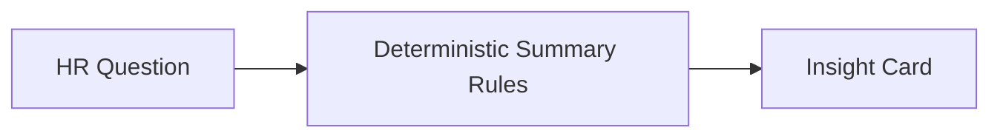

# AI Usage

## Product prompts
These prompts are intended for future AI-assisted workflows and product experimentation. The current implementation uses deterministic rule-based summaries rather than calling external models.

## Prompt 1
Generate a scalable database schema for an employee salary management system supporting 10,000 employees.

## Prompt 2
Review repository pattern implementation and suggest improvements.

## Prompt 3
Optimize salary queries for PostgreSQL indexes.

## Prompt 4
Generate meaningful unit tests for salary calculations.

## Prompt 5
Review authentication flow for security vulnerabilities.

## Prompt 6
Suggest accessibility improvements.

## Prompt 7
Review codebase for SOLID violations.

## Mermaid flow

## Current implementation note
The app generates insights from local aggregate logic so it remains deterministic, inexpensive, and safe to run without external AI services.
