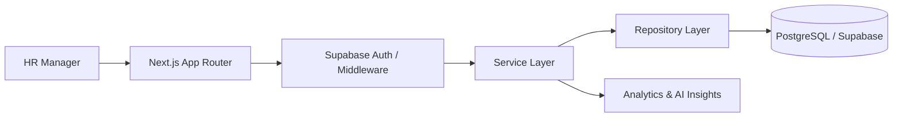

# Architecture Overview

## Principles

- Keep business logic in services and repositories
- Keep UI components small and reusable
- Prefer typed schemas and explicit interfaces
- Make the app deployable on Vercel with a Supabase-ready data layer

## Suggested Structure

```text
app/                # route handlers and pages
components/         # shared UI building blocks
features/           # domain-specific feature modules
lib/                # shared configuration and utilities
services/           # business use cases
repositories/       # data access layer
hooks/              # reusable hooks
types/              # shared types
utils/              # helpers and formatting
tests/              # unit, integration, and E2E tests
supabase/           # SQL helpers and migrations
scripts/            # seeding and maintenance scripts
```

## Runtime Flow



## Data Model

- employees
- countries
- departments
- salary_records
- salary_components
- users
- audit_logs

## Deployment Notes

- Vercel hosts the Next.js app
- Supabase provides auth and PostgreSQL persistence
- Local seed data powers development and demos when remote credentials are absent

## Architecture Decisions

- Use a service layer to keep business workflows testable and independent from UI
- Use repositories to abstract persistence so the same domain logic can work with demo data or Supabase
- Use Zod validation at the service boundary for forms, imports, and API payloads
- Favor pagination, filtering, and server-friendly queries over loading everything into memory
